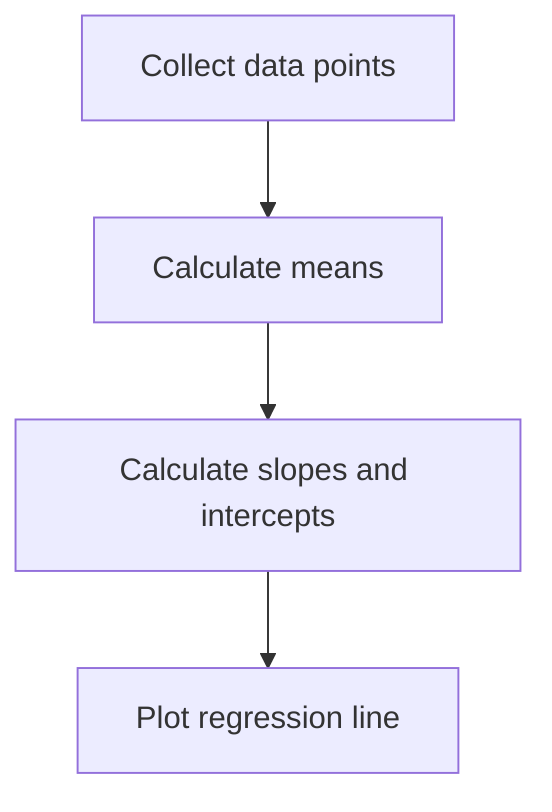
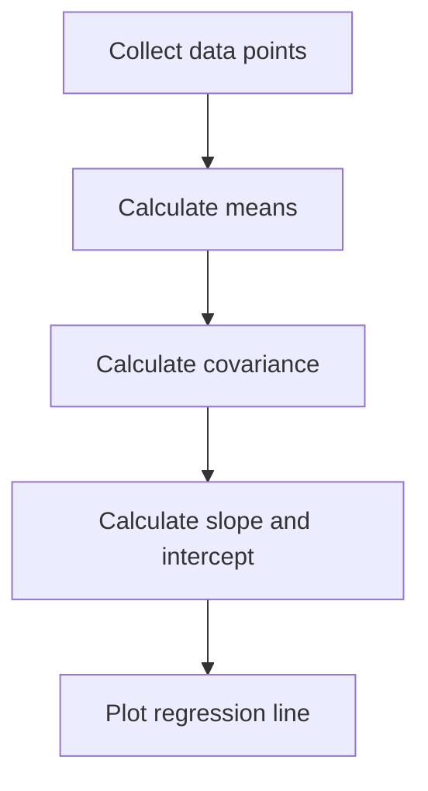
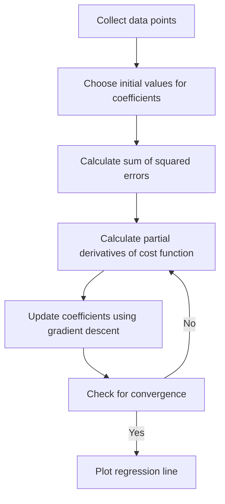

# Least Squares Problems

Least squares problems are mathematical optimization problems that involve finding the parameters of a model that minimize the sum of the squared differences between the observed data and the predicted values of the model. In other words, it seeks to find the "best-fit" line or curve that passes through a set of data points.

The least squares problem arises in many fields, including statistics, engineering, physics, and economics. It is often used to fit a regression line to a set of data points, where the goal is to find the line that best describes the relationship between two variables.

The solution to the least squares problem involves finding the values of the parameters that minimize the sum of the squared differences between the observed data and the predicted values. This can be done using various numerical methods, such as gradient descent or the normal equations, depending on the complexity of the model and the size of the data set.

# Solving Least Squares Problems



There are different formulas that can be used to solve least squares problems, depending on the specific problem and the approach chosen to solve it. Here are two common methods:

1. Normal equations method:


The normal equations are a set of equations that can be used to find the coefficients of the linear regression model that minimize the sum of squared errors. The normal equations for a simple linear regression model with one independent variable are:
```css
b1 = (nΣxy - ΣxΣy) / (nΣx^2 - (Σx)^2)
b0 = ȳ - b1x̄
```
where:

- b1 is the coefficient of the independent variable (slope of the line)
- b0 is the intercept of the line
- n is the number of data points
- x and y are the data points
- x̄ and ȳ are the means of the data points


2. Gradient descent method:

NOTE: These are simplified flowcharts and that there may be additional steps or variations depending on the specific problem and approach used to solve it.

Gradient descent is an iterative optimization algorithm that seeks to find the minimum of a function. In the case of the least squares problem, the function to minimize is the sum of squared errors. The algorithm updates the coefficients of the linear regression model in the opposite direction of the gradient of the cost function. The update rule for the coefficients in the gradient descent algorithm is:
```css
b1 := b1 - α * Σ(yi - b1xi - b0) * xi
b0 := b0 - α * Σ(yi - b1xi - b0)
```
where:

- := denotes assignment
- α is the learning rate (a hyperparameter that determines the step size of the algorithm)
- Σ denotes the sum of over all data points (i=1 to n)
- xi and yi are the ith data point
- b1 and b0 are the coefficients of the linear regression model (slope and intercept, respectively)

Both methods can be used to find the coefficients of the linear regression model that minimize the sum of squared errors. However, the normal equations method has a closed-form solution, while the gradient descent method requires iterative updates and may converge more slowly for large data sets.

# Example in python (normal equations method)

```
import numpy as np
import matplotlib.pyplot as plt

# Generate some sample data
x = np.array([1, 2, 3, 4, 5])
y = np.array([2, 3, 5, 6, 7])

# Calculate means
x_mean = np.mean(x)
y_mean = np.mean(y)

# Calculate covariance
cov = np.sum((x - x_mean) * (y - y_mean))

# Calculate slope and intercept using normal equations
b1 = cov / np.sum((x - x_mean)**2)
b0 = y_mean - b1 * x_mean

# Plot the regression line and data points
plt.scatter(x, y)
plt.plot(x, b1 * x + b0, color='red')

# Show the plot
plt.show()
```

Explanation of the code:

- The script generates some sample data using numpy arrays.
- The means of the x and y values are calculated using the numpy mean() function.
- The covariance between x and y is calculated using numpy arrays and the formula for covariance.
- The slope and intercept of the regression line are calculated using the normal equations method.
- The regression line and data points are plotted using the matplotlib scatter() and plot() functions.
- The plot is displayed using the matplotlib show() function.

# Example in python ( gradient descent method)

```
import numpy as np
import matplotlib.pyplot as plt

# Generate some sample data
x = np.array([1, 2, 3, 4, 5])
y = np.array([2, 3, 5, 6, 7])

# Define the cost function
def cost_function(x, y, b0, b1):
    error = y - (b0 + b1 * x)
    return np.sum(error**2) / (2 * len(x))

# Initialize coefficients
b0 = 0
b1 = 0

# Set learning rate and number of iterations
alpha = 0.01
iterations = 1000

# Gradient descent
for i in range(iterations):
    # Calculate partial derivatives of cost function
    b0_gradient = np.sum((b0 + b1 * x) - y) / len(x)
    b1_gradient = np.sum(((b0 + b1 * x) - y) * x) / len(x)
    # Update coefficients using gradient descent
    b0 -= alpha * b0_gradient
    b1 -= alpha * b1_gradient
    # Calculate cost function to track progress
    cost = cost_function(x, y, b0, b1)
    print(f"Iteration {i+1}: b0 = {b0:.2f}, b1 = {b1:.2f}, cost = {cost:.2f}")

# Plot the regression line and data points
plt.scatter(x, y)
plt.plot(x, b1 * x + b0, color='red')

# Show the plot
plt.show()
```

Explanation of the code:

- The script generates some sample data using numpy arrays.
- The cost function is defined as the sum of squared errors between the predicted and actual y values.
- The coefficients b0 and b1 are initialized to 0.
- The learning rate (alpha) and number of iterations are set.
- The gradient descent loop is run for the specified number of iterations.
- The partial derivatives of the cost function are calculated using numpy arrays and the formula for gradient descent.
- The coefficients are updated using the gradient descent algorithm.
- The cost function is calculated at each iteration to track the progress of the algorithm.
- The regression line and data points are plotted using the matplotlib scatter() and plot() functions.
- The plot is displayed using the matplotlib show() function.
